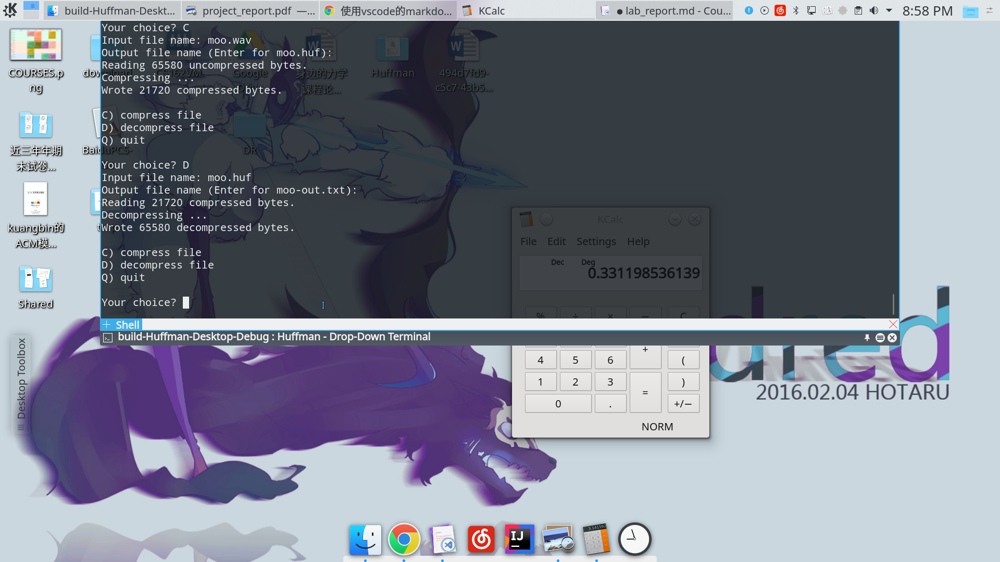

# Data Structures and Algorithms Laboratory Projects Report
# Huffman Code

## 常家奇 2017141493004 第二组

## Date: 2019-11-29

## Chapter 1: Introduction
> 哈夫曼编码(Huffman Coding)，又称霍夫曼编码，是一种编码方式，哈夫曼编码是可变字长编码(VLC)的一种。Huffman于1952年提出一种编码方法，该方法完全依据字符出现概率来构造异字头的平均长度最短的码字，有时称之为最佳编码，一般就叫做Huffman编码（有时也称为霍夫曼编码）。

## Chapter 2: Algorithm Specification

## 主要数据结构设计说明
- `Map`类，斯坦福大学提供的C++扩展库，重写了流的输入与输出。
- `istream`类，C++ 标准库中的流。
- `priority_queue`类，C++ 算法标准库中的优先队列。
- `ibitstream`以及`obiestream`类，斯坦福大学提供的C++扩展库，根据C++标准库`ifstream,ostream`重写输入输出流，使其支持按位读入/输出。
- `HuffmanNode`类，哈夫曼树的节点。
- `FrequencyTable`，频率表。
- `EncodingTree`，构建好的哈夫曼树。
- `EncodingMap`，根据哈夫曼树构建的01串表。

## 系统设计思想
> 将哈夫曼树结点，压缩/解压缩，主函数分离。

## 流程图：
------
### 压缩
```flow
st=>start: 开始
e=>end: 结束
op=>operation: 构建频率表
op0=>operation: 将频率表输出到文件
op1=>operation: 构建哈夫曼树
op3=>operation: 构建0-1串表
op4=>operation: 将文件中每个字符的01串出处到文件
st->op->op0->op1->op3->op4->e
```

- 首先，记录待压缩的文件中每个字符出现的频率，构建频率表，然后根据频率表构建哈夫曼树，定义哈夫曼树的节点有两个分支，为0和1.
- 然后，将频率表写入到输出文件中，做解压缩时所需。
- 其次，根据哈夫曼树得到文件中每个字符代表的01串表。
- 最后，根据得到的01串表将文件中每个字符以01串输出到输出文件中。

---
### 解压缩
```flow
st=>start: 开始
e=>end: 结束
op=>operation: 从文件中读入频率表
op0=>operation: 根据频率表重构哈夫曼树
op1=>operation: 根据哈夫曼树按位读取压缩文件，当读取到根节点时，输出到文件
st->op->op0->op1->e
```
- 首先，根据文件头的频率表重建哈夫曼树。
- 然后，按位读取文件中的数据，当对应到哈夫曼的根节点（字符节点）时，将字符输出到解压缩文件中，知道文件结束。
---

## Chapter 3: Testing Results

### Test Case 1:

哈母雷特小说:
- THE TRAGEDY OF HAMLET, PRINCE OF DENMARK

>压缩前：191734 Bytes
>压缩后：106020 Bytes
>压缩比率： 0.45

解压缩
Success.

- Result:


### Test Case 2:

图片文件:
- HelloKitty.bmp
>压缩前：1470054 Bytes
>压缩后：415668 Bytes
>压缩比率： 0.72

解压缩
Success.

- Result:


### Test Case 3:

音频文件：
- moo.wav
>压缩前：65580 Bytes
>压缩后：21720 Bytes
>压缩比率： 0.67

解压缩：
Success.

- Result:



## Chapter 4: Analysis and Comments

- 算法分析：
压缩比率由待压缩文件决定

- 算法特色：
理论来说，只要文件的信息熵大于理论最小熵，文件就一定可以压缩成更小文件。但需要传输频率表，所以不一定成立
但哈夫曼编码压缩是无损压缩，我们可以通过压缩后的文件得到源文件。

- 算法不足：

压缩过程和解压过程都比较缓慢，大型文件需要采取优化算法。

## Declaration

> **We hereby declare that all the work done in this project titled "Huffman Code" is of our independent effort as a group.**

## Duty Assignments:

> **Programmer: 常家奇**
> **Tester: 常家奇**
> **Report Writer: 常家奇**

---

## Reference

- The Stanford C++ Libraries
  https://web.stanford.edu/dept/cs_edu/cppdoc/
  https://github.com/zelenski/stanford-cpp-library