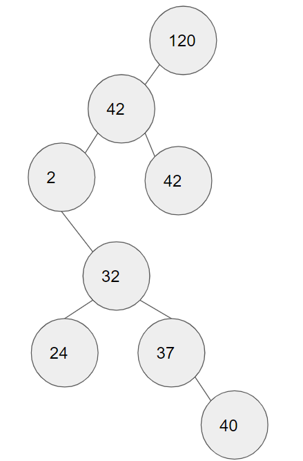
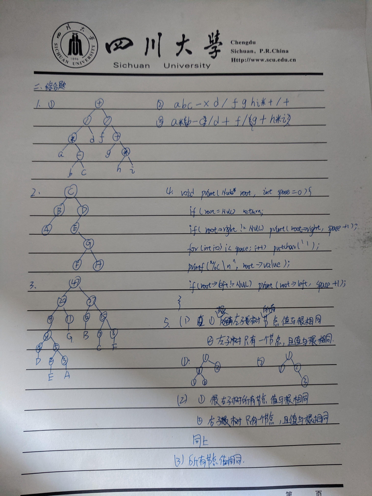
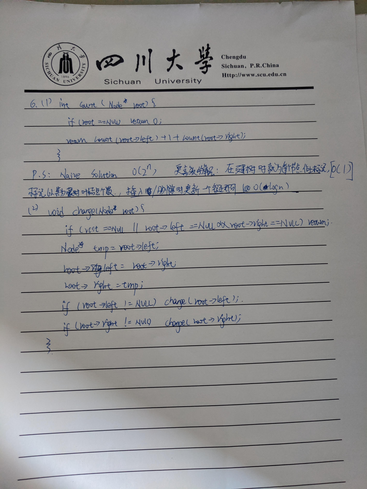

# Homework5
## 2017141493004 常家奇

- 5.5
  1. Modify the preorder traversal of Section 5.2 to perform an inorder traversal of a binary tree.
  ```cpp
  template <typename E>
  void inorder(BinNode<E>* root){
    if (root == NULL) return;
    inorder(root->left());
    visit(root);
    inorder(root->right());
  }
  ```
  2. Modify the preorder traversal of Section 5.2 to perform a postorder traversal of a binary tree.
  ```cpp
  template <typename E>
  void postorder(BinNode<E>* root){
    if (root == NULL) return;
    postorder(root->left());
    postorder(root->right());
    visit(root);
  }
  ```
- 5.7
  > 使用`stl`库中的`queue`来实现宽度优先遍历.
  ```cpp
  void bfs(BinNode<E>* root){
    typedef pair<BinNode<E>*,int> P;
    queue<P> q;
    q.push(P(root,0));
    while (!q.empty()){
      P pNode = q.front(); q.pop();
      cout << "Level" << pNode.second << ":" << pNode.first->value << endl;
      if (pNode.first->left()!=NULL) q.push(P(pNode.first->left(),pNode.second+1));
      if (pNode.first->right()!=NULL) q.push(P(pNode.first->right(),pNode.second+1));
    }
  }
  ```
- 5.14
  一般计算机科学中,区间表示有个不成文的规定:左闭右开.
- 5.17
  
- 5.21
  ```cpp
  bool checkBST(BinNode<E>* root){
    if (root == NULL) return true;
    E v = root->value;
    bool left = checkBST(root->left());
    if (root->left() != NULL) left &= v>root->left()->value;
    bool right = checkBST(root->right());
    if (root->right() != NULL) right &= v<=root->right()->value;
    return left && right;
  }
  ```

### 补充作业题
1. > 1.b 2.a

2. 



