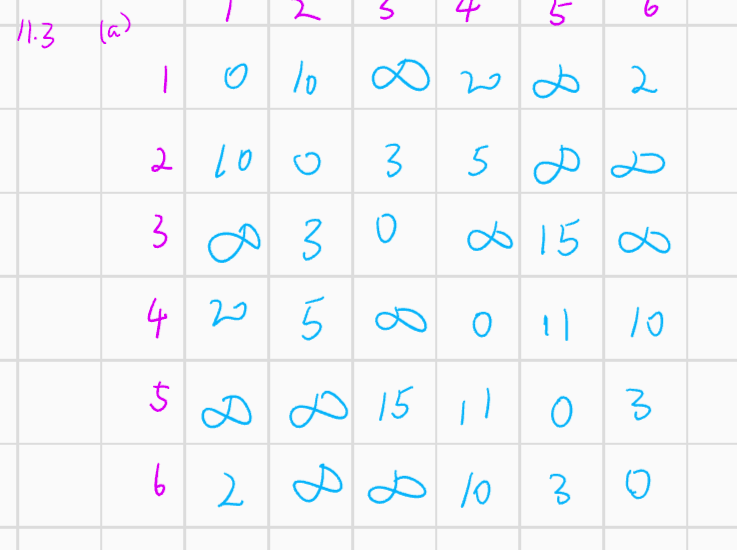
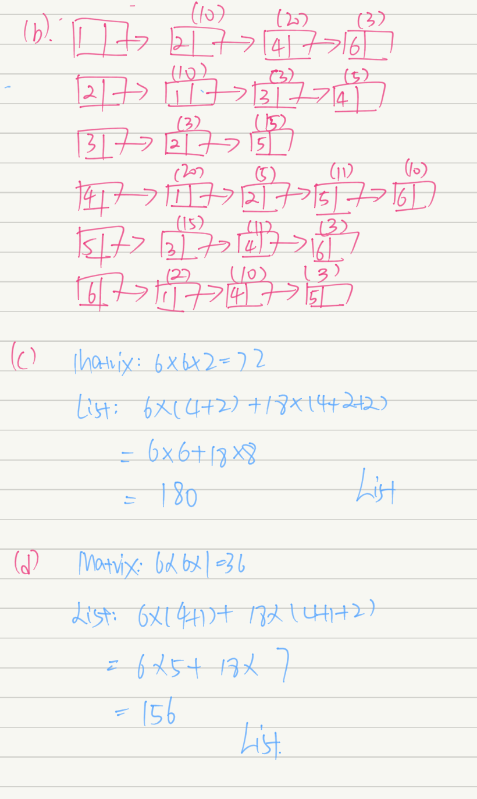
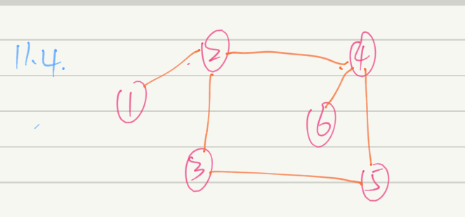
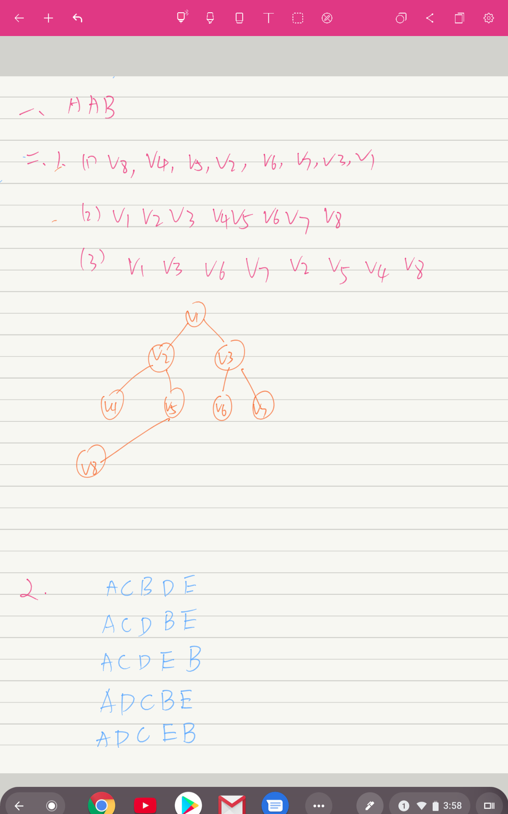
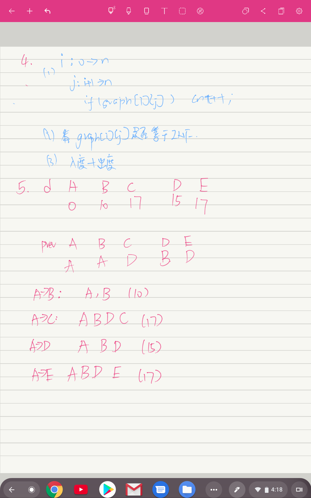

# 第11章 Graph
# 2017141493004 常家奇

## 11.3



## 11.4


## 11.5
```cpp
vector<int> G[maxn];
int vis[maxn];
memset(vis,0,sizeof(vis));
void dfs(int x){
  if (vis[x]) return;
  /*
    Do sth for node x;
  */
  vis[x] = 1;
  for (int n : G[x])
    dfs(n);
}

```

## 11.8

  增加一個訪問次數的數組，檢測到環(vis[i] > 1)就輸出。

## 11.15
```cpp
vector<int> graph[maxn];
int vis[maxn];
// memset(vis,0,sizeof(vis));
stack<int> res;
bool dfs(int x){
  vis[x] = -1;
  for (int next : graph[x]){
    if (vis[next] == -1) return false;
    else if (!vis[next]) dfs(next);
  }
  vis[x] = 1;
  res.push(x);
  return true;
}

/* for (int i=0;i<n;i++){
*    if (!vis[i]){
*      if (!dfs(i)) // have circle.   
*    }
*  }
*
*/

```


## 3

```cpp
// struct list{
//   int v;
//   struct list* next;
// }
const int INF = 1e7;
void convert(int G[][],int n,vector<list*>& l[]){
  for (int i=0;i<n;i++)
    for (int j=0;j<n;j++) G[i][j] = INF;
  for (int i=0;i<n;i++){
    list* traval = l[i];
    while (traval){
      G[i][traval] = traval->v;
      traval = traval->next;
    }
  }
}
```

```cpp
vector<vector<int>> graph;
const int maxn = 10000 + 10;
int n; // count of v
int in[maxn];
int out[maxn];

void count(vector<vector<int>>& graph){
  memset(in,0,sizeof(in));
  memset(out,0,sizeof(out));
  for (int i=0;i<graph.size();i++){
    out[i] = graph[i].size();
    for (int x : graph[i])
      in[x] += 1;
  }
}

vector<int> get_root(vector<vector<int>>& graph){
  vector<int> res;
  count(graph);
  for (int i=0;i<n;i++)
    if (!in[i]) res.push(i);
  return res;
}

```

