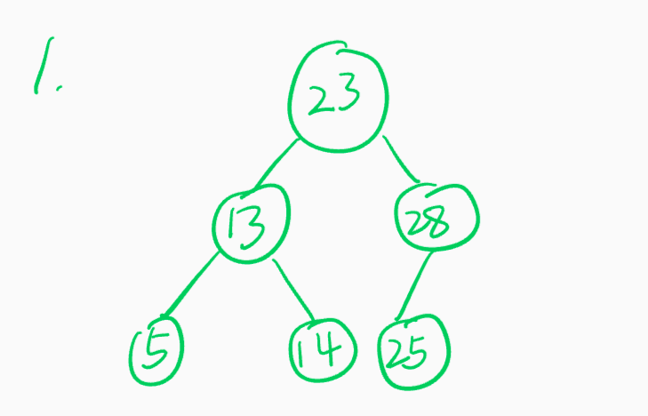
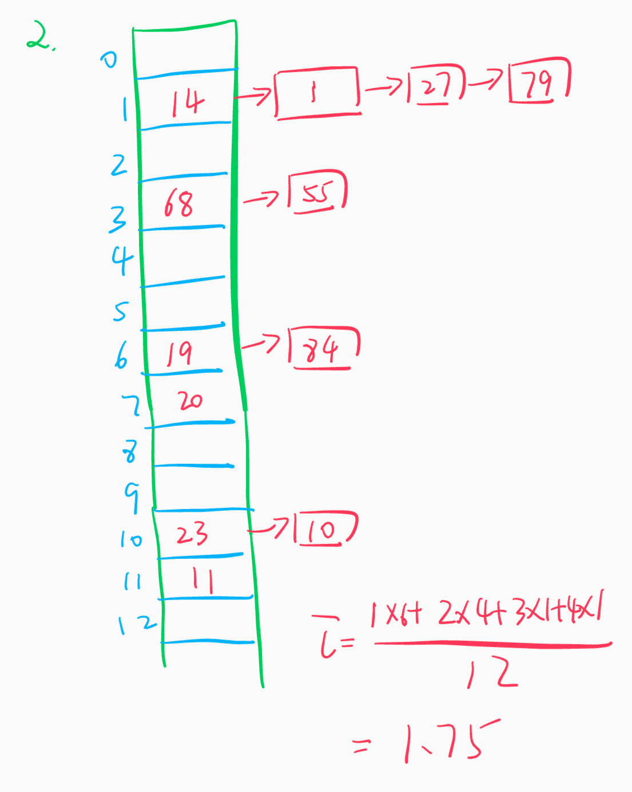
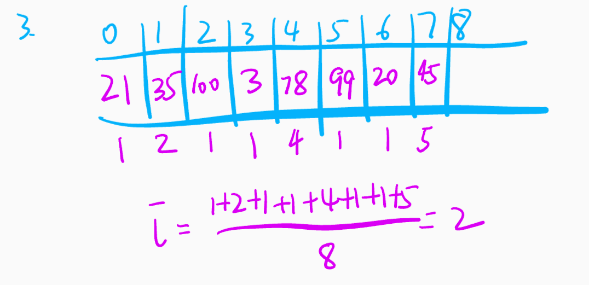
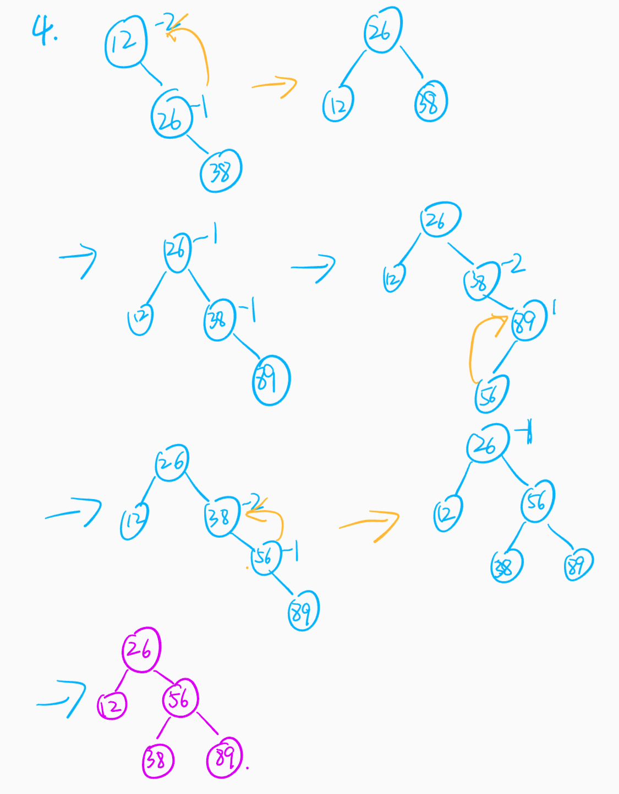

# 第9章 查找
# 2017141493004 常家奇

## 一
- A B B

## 二

1. 

2. 

3. 

4. 

5. 

```cpp
bool isBST(node* root){
  if (!root) return true;
  if (!root->left) return root->value <= root->right->value && isBST(root->right);
  if (!root->right) return root->value > root->left->value && isBST(root->left);
  return root->value > root->left->value &&
    root->value <= root->right->value &&
    isBST(root->left) && isBST(root->right);
}
```

6.

```cpp
list<node> space[maxn];
void insert(node x){
  int idx = hash(x);
  space[idx].push_back(x);
}
```