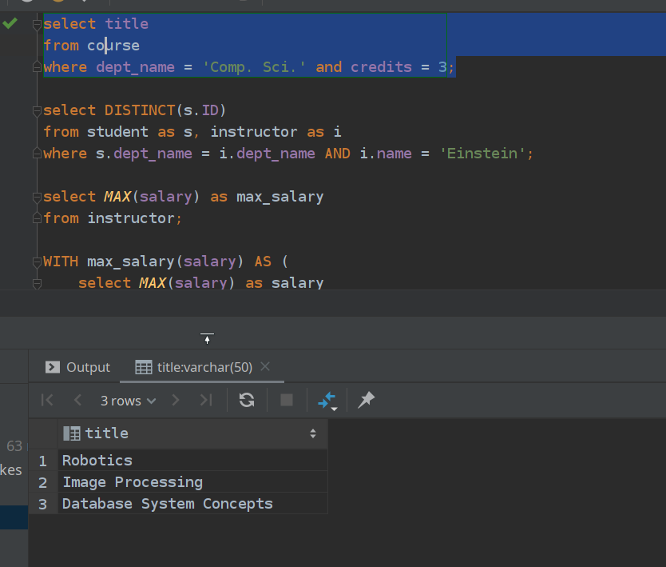
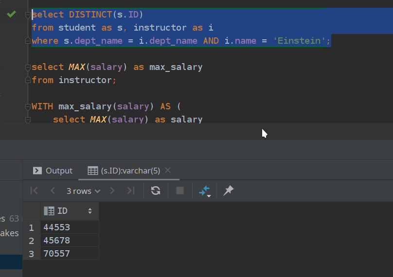
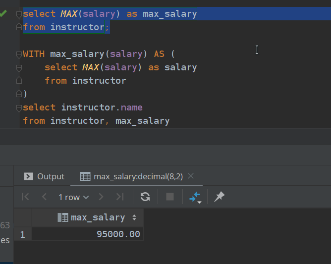
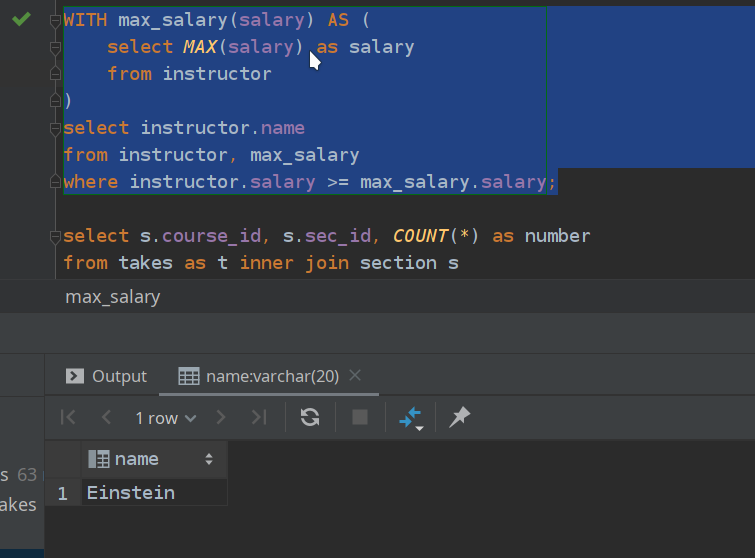
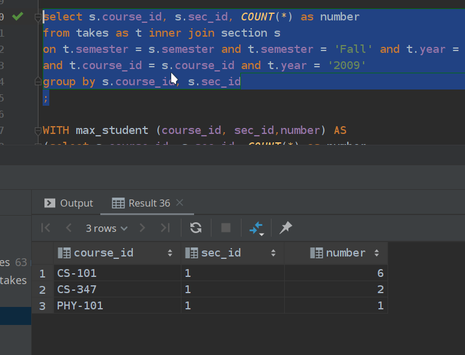
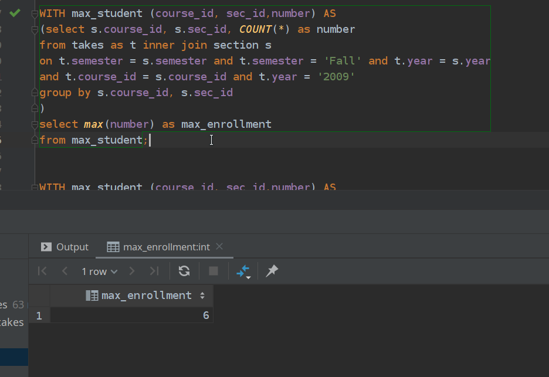
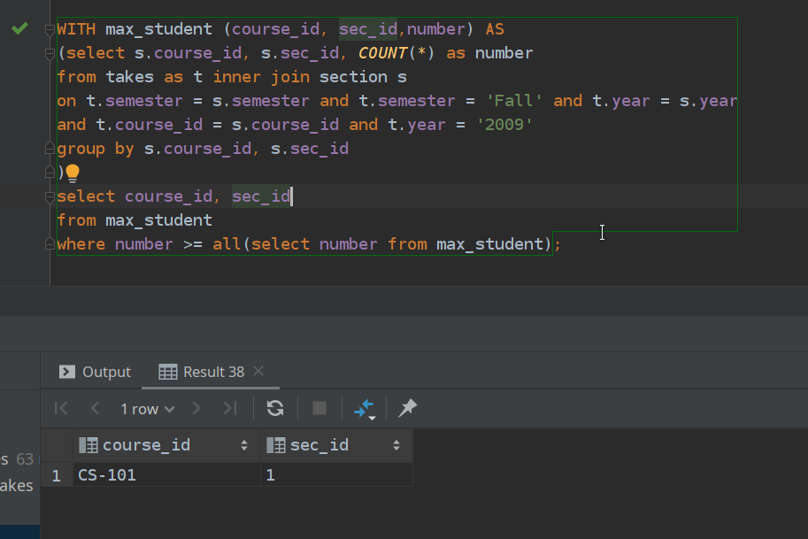

# 2017141493004_常家奇_数据库_第四周

## 3.1a

```sql
select title
from course
where dept_name = 'Comp. Sci.' and credits = 3;
```



## 3.1b

```sql
select DISTINCT(s.ID)
from student as s, instructor as i
where s.dept_name = i.dept_name AND i.name = 'Einstein';
```



## 3.1c

```sql
select MAX(salary) as max_salary
from instructor;
```



## 3.1d

```sql
WITH max_salary(salary) AS (
    select MAX(salary) as salary
    from instructor
)
select instructor.name
from instructor, max_salary
where instructor.salary >= max_salary.salary;
```



## 3.1e

```sql
select s.course_id, s.sec_id, COUNT(*) as number
from takes as t inner join section s
on t.semester = s.semester and t.semester = 'Fall' and t.year = s.year
and t.course_id = s.course_id and t.year = '2009'
group by s.course_id, s.sec_id
;
```



## 3.1f

```sql
WITH max_student (course_id, sec_id,number) AS
(select s.course_id, s.sec_id, COUNT(*) as number
from takes as t inner join section s
on t.semester = s.semester and t.semester = 'Fall' and t.year = s.year
and t.course_id = s.course_id and t.year = '2009'
group by s.course_id, s.sec_id
)
select max(number) as max_enrollment
from max_student;
```


## 3.1g

```sql
WITH max_student (course_id, sec_id,number) AS
(select s.course_id, s.sec_id, COUNT(*) as number
from takes as t inner join section s
on t.semester = s.semester and t.semester = 'Fall' and t.year = s.year
and t.course_id = s.course_id and t.year = '2009'
group by s.course_id, s.sec_id
)
select course_id, sec_id
from max_student
where number >= all(select number from max_student);
```
