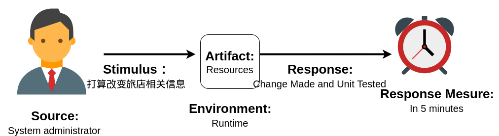
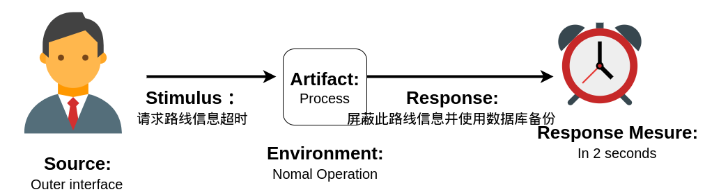
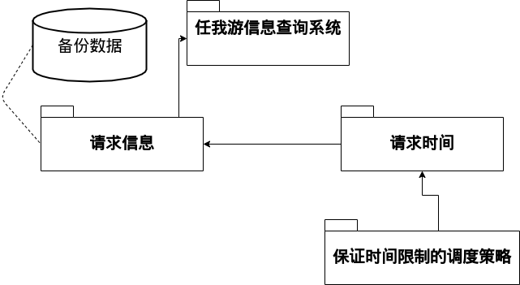
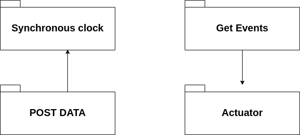
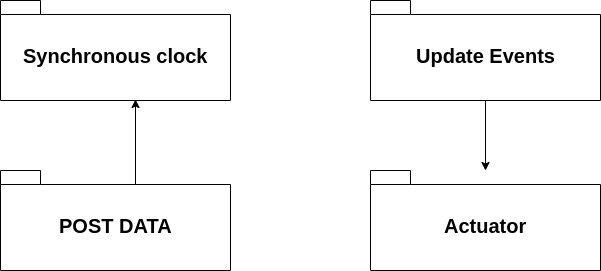
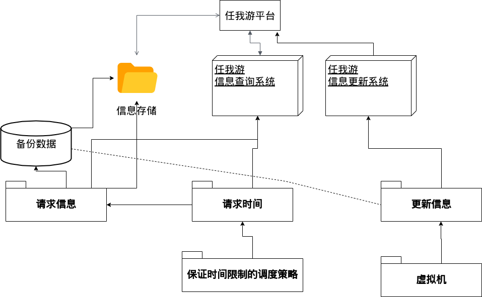

# "任我游"项目
## 2017141493004 常家奇

## 简介(describe)

### 摘要(Abstract)
>目前市面上存在不少的房屋租借平台，然而他们普遍存在几点问题：页面不够简洁，无法突出平台重点,很多平台不仅提供房屋租界，同时还提供旅游资源介绍、火车票和机票的售卖，虽然能够使网站的涉及面宽广，但也一定程度降低了每一个模块的品质，使得对产品品质要求高的用户无法满意。信息分享和交流缺失,很多平台在推广产品的时候，只注重了产品这一个东西，却缺少了对于此产品所覆盖的其他东西，而其中很重要的一点就是信息的分享和交流。本项目旨在开发一款满足用户商户需求的民宿旅游平台。为用户提供更好的房屋以及售后服务，同时为商户提供更多地出租机会。同时营造一个游客们的交流平台，为平台提供一定的人文气息。

### 商业目标(Business Goal)
1. 集合旅游客户与供应商
2. 向用户提供推广一整套旅游度假产品
3. 聚合庞大的旅游资源
4. 和大量供应商之间保持良好的合作关系
5. 积累大量的用户群

### 功能简介(Function)
1. 建立旅游景点,用户可以获取旅游景点相关信息。
2. 客户可以规划他们的旅行路线或预订酒店服务。
3. 客户可以获得他们选择的火车或飞机的信息。
4. 客户可以预订火车/飞机，系统将自动推荐最便宜的机票/火车票。
4. 如果这些服务不能满足客户的需求或不满意，客户可以通过旅游网站反馈，我们会尽快响应客户。旅游网站将根据客户的问题提供解决方案。

## 描述构架(Design an architecture)

### FUNCTIONAL REQUIREMENTS

`任我游`平台分为两个子系统：任我游信息查询系统和任我游信息更新系统。

任我游信息更新系统会向任我游平台发送信息更新。Ex：路线更新，旅店信息更新等。如果发生故障，在两秒之内关闭任我游更新系统并通知系统管理员介入。

任我游信息查询系统将为用户返回查询信息(旅店信息，景点信息)等。当查询用户小于10000时，保证系统的响应时间为20ms，当查询用户大于20000时，保证系统的响应时间为500ms。

### DESIGN CONSTRAINTS 

#### capacity restrictions
- 处理器的使用率不得高于80%
- LAN使用率不得高于80%
- 每秒至少可以处理100个查询和25个更新

#### persistent storage service
- 系统每1分钟检测备份。
- 如果检测失败，则整个系统重启并回滚到上一次成功状态。

### QUALITY ATTRIBUTE REQUIREMENTS 

#### **可修改性(Modifiability)**

##### 描述
因为旅行路线会经常会发生改变(如修路、自然灾害等突发状况)，旅店信息/景点信息也会常常变动，也会有新的景点、旅店请求加入到`任我游`中，所以可修改性是系统必不可少的质量属性。

##### 场景

1.

Portion of Scenario   | Possible Values
----------------------|----------------
Source | 系统管理员
Stimulus | 打算改变路线相关信息
Artifact | 系统资源
Environment | 运行期
Response | 改变并且对其作出测试
Response mesure | 三小时内

2.
Portion of Scenario   | Possible Values
----------------------|----------------
Source | 系统管理员
Stimulus | 打算改变旅店相关信息
Artifact | 系统资源
Environment | 运行期
Response | 改变并且对其作出测试
Response mesure | 五分钟内

3.
Portion of Scenario   | Possible Values
----------------------|----------------
Source | 系统管理员
Stimulus | 打算改变景点相关信息
Artifact | 系统资源
Environment | 运行期
Response | 改变并且对其作出测试
Response mesure | 五分钟内

#### **可用性(Availability)**

##### 描述
因为几乎任何时间段都有用户使用`任我游`平台，所以保证软件的高可用性是必要的。

##### 场景

1.

Portion of Scenario   | Possible Values
----------------------|----------------
Source | 任我游平台外部信息接口
Stimulus | 请求旅店信息超时
Artifact | 处理器
Environment | 正常操作
Response | 屏蔽此旅店信息并使用数据库备份
Response mesure | 2秒内

2.
Portion of Scenario   | Possible Values
----------------------|----------------
Source | 任我游平台外部信息接口
Stimulus | 请求路线信息超时
Artifact | 处理器
Environment | 正常操作
Response | 屏蔽此路线信息并使用数据库备份
Response mesure | 2秒内

3.
Portion of Scenario   | Possible Values
----------------------|----------------
Source | 任我游平台内部信息接口
Stimulus | 请求资源超时/不可达
Artifact | 处理器
Environment | 正常操作
Response | 使用备份资源
Response mesure | 10秒内

#### **性能(Performance)**

##### 描述
在旅游旺季，使用`任我游`平台的人数会增加，所以为了提高用户体验，所以保证软件的高性能是必要的。

##### 场景

1. 
Portion of Scenario   | Possible Values
----------------------|----------------
Source | 用户
Stimulus | 对`任我游`平台发送请求
Artifact | 系统
Environment | 正常
Response | 请求被受理
Response mesure | 2秒内

2. 
Portion of Scenario   | Possible Values
----------------------|----------------
Source | 用户
Stimulus | 对`任我游`平台发送请求
Artifact | 系统
Environment | 正常
Response | 请求被受理
Response mesure | 百分之1的丢包率

3. 
Portion of Scenario   | Possible Values
----------------------|----------------
Source | 用户
Stimulus | 对`任我游`平台发送请求
Artifact | 系统
Environment | 高峰
Response | 请求被受理
Response mesure | 7秒内

4. 
Portion of Scenario   | Possible Values
----------------------|----------------
Source | 用户
Stimulus | 对`任我游`平台发送请求
Artifact | 系统
Environment | 高峰
Response | 请求被受理
Response mesure | 百分之10的丢包率

## ADD方法

### Choose the element

- 任我游信息查询系统

### Identify the ASRs for the closen element

- 因为任我游请求信息必须有备份数据，这是可用性

- 因为请求任我游信息时间<2s,这是性能

#### Choose Tatics

对于可用性，采取热冗余战术。
对于高性能，采取调度战术。

#### Refine

- 将系统中的数据做热冗余，保证系统的高可用性。
- 同时对查询请求采取适当的调度策略，保证系统的高性能。

### Architectural Views

#### Module Decomposition View

#### Concurrency View

> 当查询请求个更新数据请求同时进行时，将更新数据请求放置在等待队列中，当所有查询请求完毕后再更新数据。

#### Deployment View

- 信息查询系统与系统中数据有交互。

### Choose the element

- 任我游信息更新系统

### Identify the ASRs for the closen element

- 因为任我游旅店/景点等信息需要改变，所以要保证系统的可修改性

- 因为要保证用户可使用，所以这是可用性

#### Choose Tatics

对于可用性，采取热冗余战术。
对于可修改性，采取虚拟机战术。

#### Refine

- 将系统中的数据做热冗余，保证系统的高可用性。
- 同时对对数据采取虚拟机策略，保证系统的可修改性。

### Architectural Views

#### Module Decomposition View

#### Concurrency View

> 当查询请求个更新数据请求同时进行时，将更新数据请求放置在等待队列中，当所有查询请求完毕后再更新数据。

#### Deployment View

- 信息更新系统与系统中的数据有交互。

### Summary

`任我游`平台分为两个子系统：任我游信息查询系统和任我游信息更新系统。

任我游信息更新系统会向任我游平台发送信息更新。Ex：路线更新，旅店信息更新等。如果发生故障，在两秒之内关闭任我游更新系统并通知系统管理员介入。

任我游信息查询系统将为用户返回查询信息(旅店信息，景点信息)等。当查询用户小于10000时，保证系统的响应时间为20ms，当查询用户大于20000时，保证系统的响应时间为500ms。

系统保证了高性能，高可用性，可修改性。