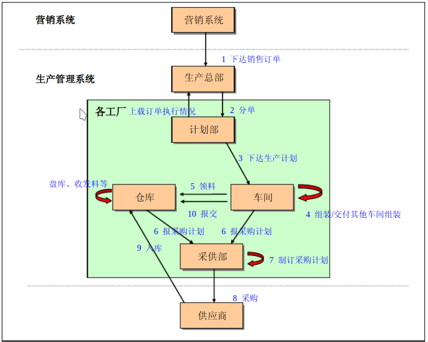
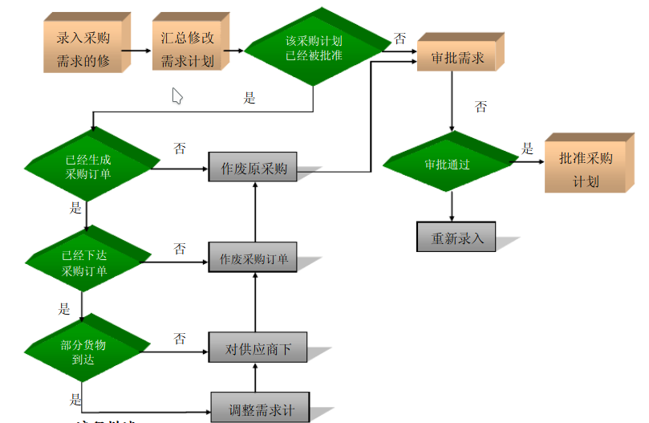

# 2017141493004 常家奇
## 名次解释
### 软件需求工程
> 软件需求工程是需求供需双方采取被证明行之有效的原理、方法，通过使用适当的工具和符号体系，正确、全面地描述用户待开发系统的行为特征、质量要求、约束条件的过程

### 数据流图
>数据流图（Data Flow Diagram DFD）是从数据传递和加工的角度，以图形化的方式刻画数据流从输入到输出的变换过程。其包含3种基本元素：
**命名的箭头表示数据流
圆圈表示处理
矩形或其他形状表示数据存贮**

## 简答题
### 数据流图包括哪些部分的内容？如何描述数据流图？
> 数据流，输入，输出

> 命名的箭头表示数据流
圆圈表示处理
矩形或其他形状表示数据存贮

### 请自行查阅资料写出ERP软件系统的需求分析报告，包括：业务需求、用户需求和功能需求三个层次的内容

### 工厂ERP软件需求分析：

### 业务需求：

### 用户需求：
#### 订单采购

### 功能需求:

#### 成品入库  

##### 流程描述 
1. 包装车间或电控柜车间在完成包装产品后，需要将产品入库。目前的做法是每天报交一次到成品库。在报交之前，将需要报交的产品清单整理出来。在系统中，找出这些产品的任务单，生成产品入库清单。
2. 如果需要，质检部门进行一次质量检验，并把检验结果写在质量卡上。
3. 库管员需要在系统中根据打印出来的入库清单找到相应的任务单，任务单数据描述详见车间模块。比较系统中任务单、清单和质量卡，符合要求的产品则入库。
4. 在系统中把实际入库数量记录下来。这时，如果对应的任务单中产品全部入库则说明该任务单完成，否则还处于生产状态。

##### 数据描述 
报表需求 
1. 产品入库清单：根据任务单产生产品入库清单，需要包含任务单号、订单号
2. 任务单查询 
3. 销售订单查询 
4. 成品入库凭证查询：成品入库凭证和其他出入库凭证一样，只是凭证类型为成品入库类型。
